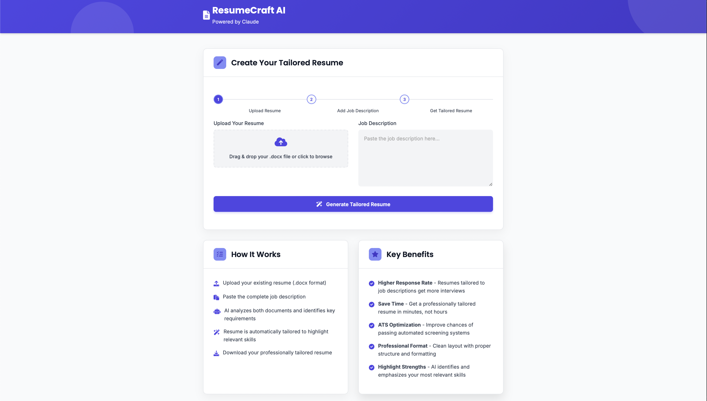

# ResumeCraft AI

A professional resume tailoring application powered by Claude AI that helps users customize their resumes to match specific job descriptions.



## Features

- Upload existing resume in .docx format
- Input job description text
- AI analysis of resume against job requirements
- Generate a tailored resume highlighting relevant skills and experience
- Download the customized resume in .docx format
- Preserves original resume formatting and structure

## How It Works

1. **Upload Your Resume**: Submit your existing .docx resume
2. **Add Job Description**: Paste the job posting you're applying for
3. **AI Analysis**: Claude AI analyzes both documents to identify key requirements
4. **Smart Tailoring**: Your resume is intelligently modified to emphasize relevant experience
5. **Download Result**: Get a professionally tailored resume as a .docx file

## Technologies Used

- **Backend**: Python with FastAPI for high-performance API
- **Frontend**: HTML5, CSS3, JavaScript with modern UI components
- **AI**: Claude API (Anthropic) for intelligent resume analysis
- **Document Processing**: python-docx for .docx file handling
- **Animation**: AOS library for smooth UI transitions
- **UI Components**: Font Awesome icons, custom responsive design

## Installation

1. Clone the repository:
   ```
   git clone https://github.com/yourusername/resume-mcp-server.git
   cd resume-mcp-server
   ```

2. Create a virtual environment and install dependencies:
   ```
   python -m venv venv
   source venv/bin/activate  # On Windows: venv\Scripts\activate
   pip install -r requirements.txt
   ```

3. Set up environment variables:
   Create a `.env` file in the project root with your Claude API key:
   ```
   CLAUDE_API_KEY=your_claude_api_key
   ```

## Usage

1. Start the server:
   ```
   uvicorn app:app --reload
   ```

2. Open your browser and navigate to http://localhost:8000

3. Upload your resume (.docx format) and paste the job description

4. Click "Generate Tailored Resume" and wait for processing

5. Download your customized resume

## API Documentation

### POST /tailor-resume

Tailors a resume to match a job description.

**Request**:
- Form data with:
  - `resume`: .docx file
  - `job_description`: String with the job description

**Response**:
- 200: Returns the tailored resume as a .docx file
- 400: Bad request (invalid file format)
- 500: Server error

## Project Structure

- `app.py`: FastAPI backend with Claude API integration
- `client.html`: Frontend UI with HTML, CSS, and JavaScript
- `requirements.txt`: Python dependencies
- `.env.example`: Example environment configuration

## License

[MIT License](LICENSE)

## Acknowledgments

- Built with Claude AI by Anthropic
- Created as a project for IS 421-102
